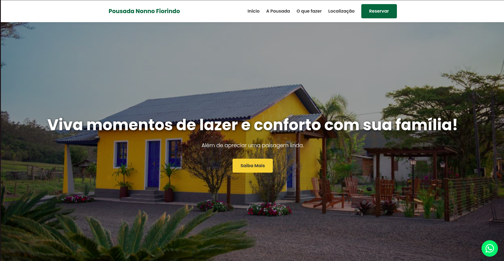
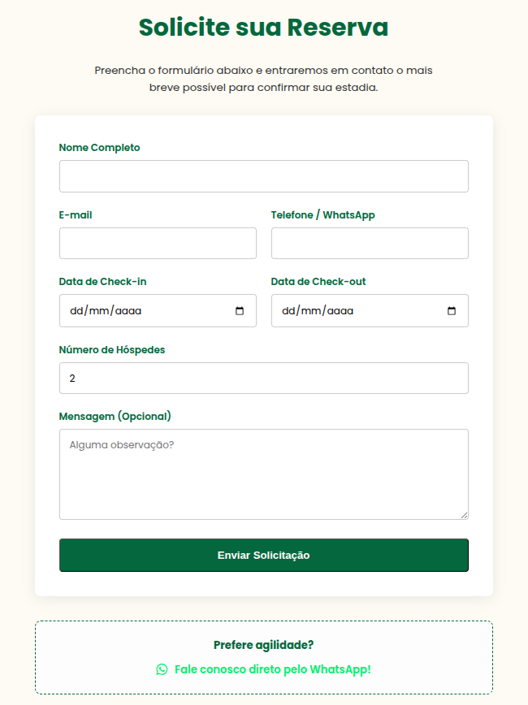

# 🏨 Site Pousada Nonno Fiorindo

Projeto de site institucional para a **Pousada Nonno Fiorindo**, desenvolvido com foco em presença digital, captação de reservas e experiência do usuário.

O sistema permite que visitantes conheçam a pousada, explorem a região e enviem solicitações de reserva diretamente para o e-mail do proprietário.

🔗 **Acesse o site:**  
https://pousada-nonno-fiorindo.vercel.app/

---

## ✨ Funcionalidades

✅ Página institucional da pousada  
✅ Seção "O que oferecemos"  
✅ Seção "Explore a região"  
✅ Localização da pousada  
✅ Botão direto para WhatsApp  
✅ Formulário de reserva  
✅ Envio de e-mail automático com Resend  
✅ Layout responsivo  
✅ Foco em conversão de clientes  

---

## 🖼️ Preview do Projeto

### 📍 Página Inicial

### 📍 Página de Reserva

---

## 🛠️ Tecnologias Utilizadas

- HTML  
- CSS  
- JavaScript  
- Node.js  
- Resend (envio de e-mails)  
- Vercel (deploy)

---

## ⚙️ Como funciona o sistema de reserva

1. O usuário acessa a página **Reservar**
2. Preenche o formulário com seus dados
3. O backend envia um e-mail via **Resend**
4. O proprietário recebe a solicitação
5. O contato é feito manualmente com o cliente

👉 Esse fluxo é ideal para pousadas pequenas que trabalham com confirmação manual.

---

## 🚀 Deploy

O projeto está hospedado na **Vercel**, garantindo:

- ⚡ carregamento rápido  
- 🌎 disponibilidade online  
- 🔄 deploy contínuo  

---

## 🎯 Objetivo do Projeto

Este projeto foi desenvolvido com foco em:

- Prática de desenvolvimento web
- Projeto real de mercado
- Implementação de formulário com envio de e-mail
- Criação de site institucional responsivo

---

## 👨‍💻 Autor

Desenvolvido por **Gustavo Bada Zanatta**

- GitHub: https://github.com/Gobson995

---

⭐ Se este projeto te ajudou ou você gostou, considere deixar uma estrela!
